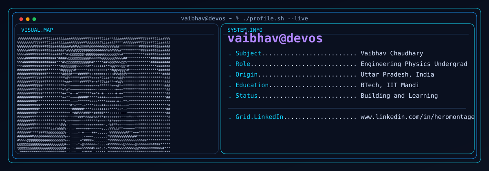

<picture>
  <source media="(prefers-color-scheme: dark)" srcset="./dark.svg">
  <source media="(prefers-color-scheme: light)" srcset="./light.svg">
  
</picture>

  

### Hi, I'm VAIBHAV CHAUDHARY 👋

I am a Developer.

- 🔭 Current focus: Building practical and interactive projects
- 🌱 Learning: JavaScript, Python, and C++
- 💬 Ask me about: development, projects, and problem-solving
